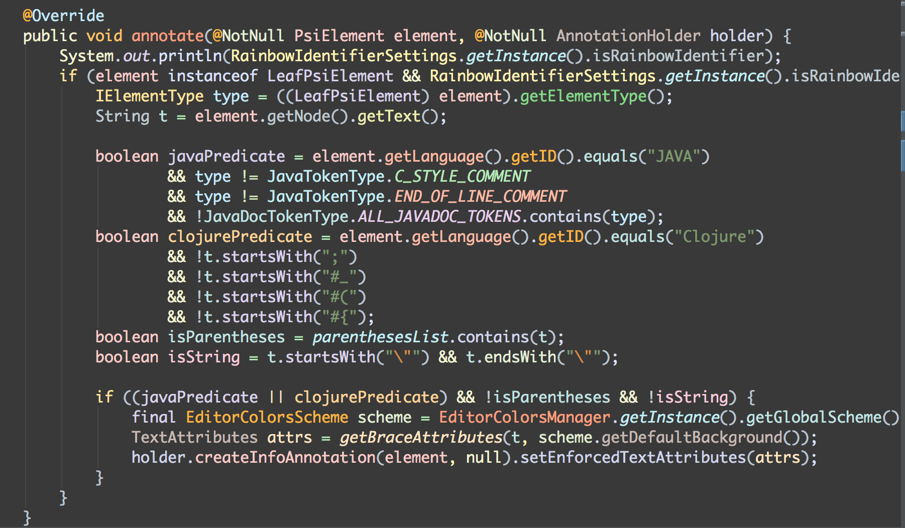
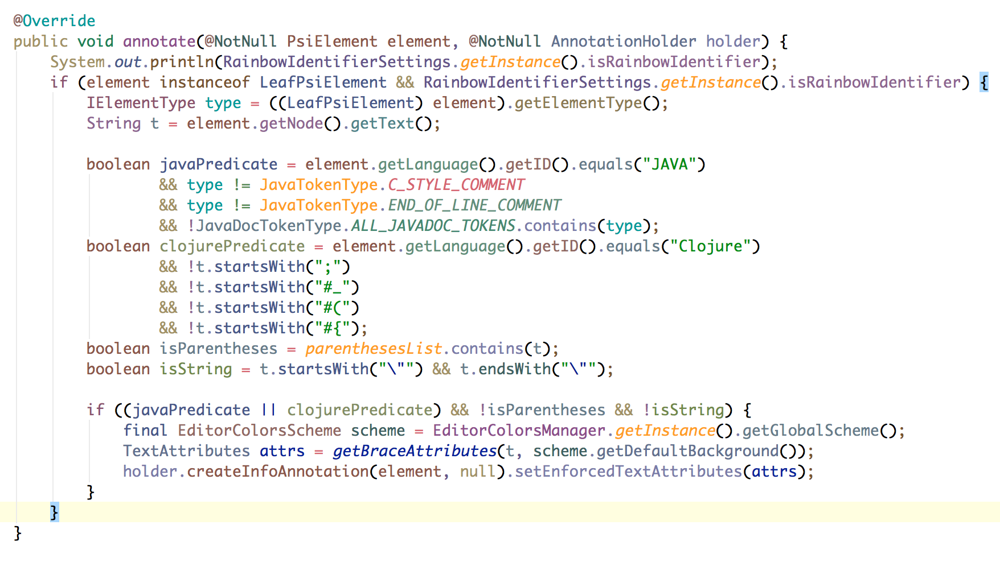
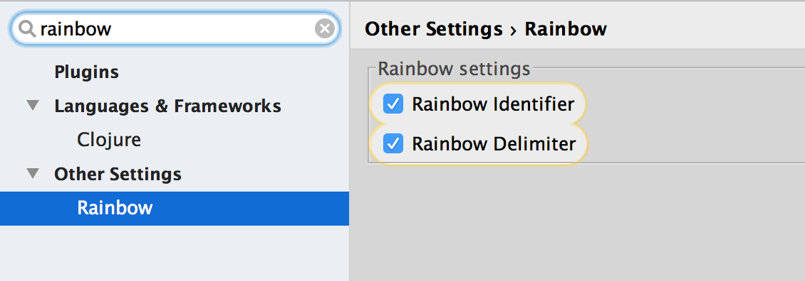

## Rainbow plugin

https://plugins.jetbrains.com/plugin/8214

* Rainbow highlighting identifiers based on their names. Each identifier gets a color based on a hash of its name.
* Rainbow highlighting delimiters such as parentheses, brackets or braces according to their depth. not just in Lisp.

## Snapshots

* for dark themes

* for light themes

## Configuration

## Support Languages

* Java
* Kotlin (IDEA 14+)
* Clojure ([Cursive](https://cursive-ide.com/) already support Rainbow Delimiter)
* Python
* Haskell
* Agda

## License

Copyright © 2016 zjhmale

Released under the terms of the MIT License
